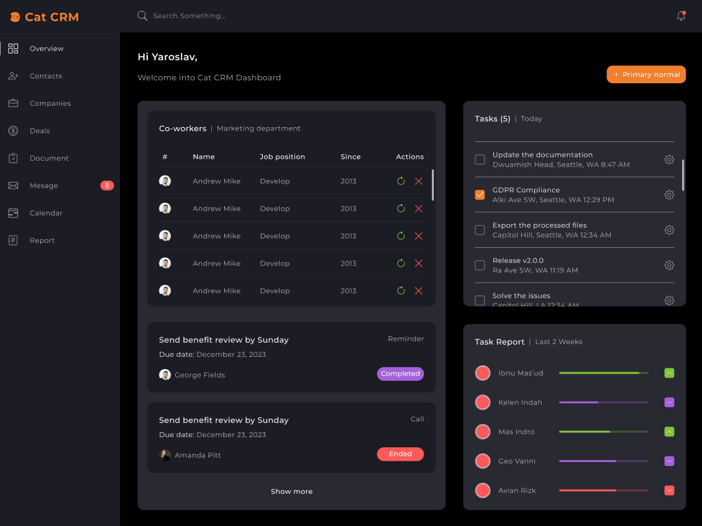

# CRM Dashboard

This is a learning project created to solidify my knowledge of SASS. The goal of the project was to develop the visual part of a CRM Dashboard without implementing functionality.

## 🛠 Technologies

The project was built using the following technologies:

- **HTML5**: for structuring the pages
- **SASS**: for writing styles
  - Use of variables, mixins, functions
  - Style inheritance (extend)
  - Nesting for structure
- **CSS3**: generated from SASS

## 📂 Project Structure

```plaintext
.
├── /src
│   ├── /css
│   │   ├── main.css                   # Generated CSS file
│   ├── /scss
│   │   ├── /base
│   │   │   ├── _base.scss             # Base styles
│   │   │   ├── _fonts.scss            # Fonts import
│   │   │   ├── _index.scss            # Forwards
│   │   │   ├── _reset.scss            # Reset styles
│   │   │   ├── _visually-hidden.scss  # Accessibility pattern styles
│   │   ├── /components
│   │   │   ├── /btn
│   │   │   │   ├── _btn-base.scss     # Base button styles
│   │   │   │   ├── _btn.scss          # Button variations
│   │   │   │   ├── /types
│   │   │   │   │   ├── _btn-base.scss # Button base types
│   │   │   ├── /coworkers
│   │   │   │   ├── _board.scss        # Styles for board component
│   │   │   │   ├── _co-workers.scss   # Styles for coworkers section
│   │   │   │   ├── _details.scss      # Detailed coworkers info
│   │   │   │   ├── _table.scss        # Coworkers table styles
│   │   │   │   ├── _badges.scss       # Badges for coworkers
│   │   │   │   ├── _companies.scss    # Companies related styles
│   │   │   │   ├── _logo.scss         # Logo styles
│   │   │   │   ├── _menu.scss         # Menu styles
│   │   │   │   ├── _menu-btn.scss     # Menu button
│   │   │   │   ├── _notification.scss # Notification section
│   │   │   │   ├── _notification-btn.scss # Notification button
│   │   │   │   ├── _reports.scss      # Reports styles
│   │   │   │   ├── _search.scss       # Search bar styles
│   │   │   │   ├── _tasks.scss        # Task-related styles
│   │   │   │   ├── _welcome.scss      # Welcome screen styles
│   │   │   ├── _index.scss            # Forwards for components
│   │   ├── /layout
│   │   │   ├── _header.scss           # Header styles
│   │   │   ├── _main.scss             # Main content styles
│   │   │   ├── _page.scss             # Page-specific styles
│   │   │   ├── _sidebar.scss          # Sidebar styles
│   │   │   ├── _index.scss            # Forwards for layout
│   │   ├── /utils
│   │   │   ├── _functions.scss        # Functions
│   │   │   ├── _mixins.scss           # Mixins
│   │   │   ├── _placeholders.scss     # Placeholders styles
│   │   │   ├── _variables.scss        # Variables
│   │   ├── main.scss                  # Main file to import all modules
├── index.html                         # Main project page
```

## 🖼 Preview



## 📖 What I Learned

- Modular SASS file organization
- Utilizing SASS nesting, variables, and mixins for clean and efficient styles
- Building scalable styles for components like buttons, coworkers sections, and notifications

## Made with ❤️ while learning SASS.
